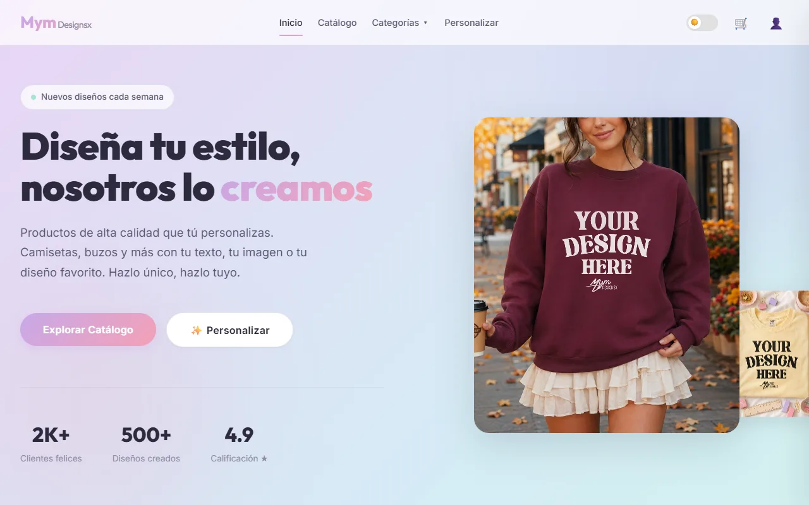
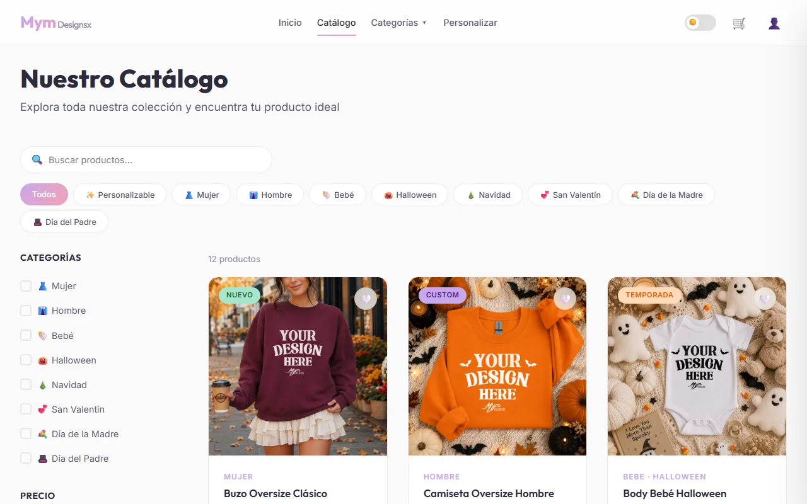
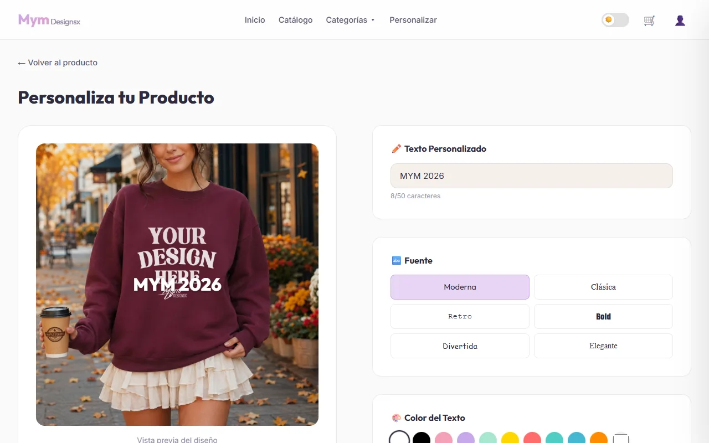
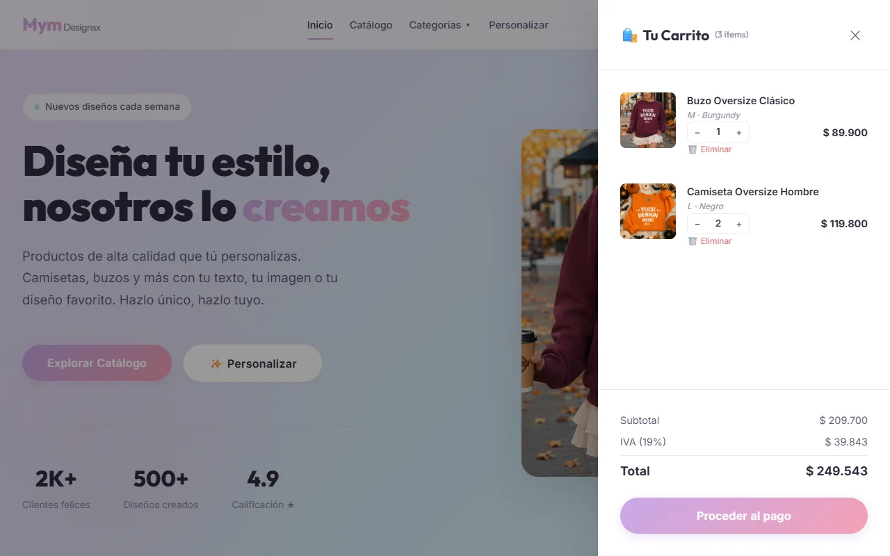
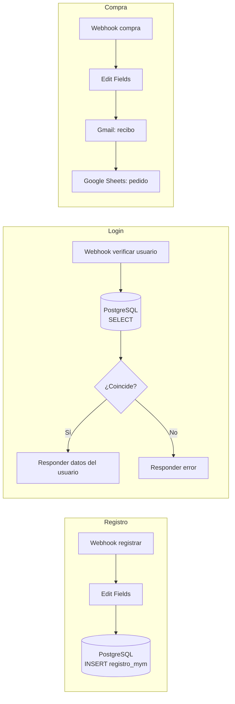

# Mym Designsx — tienda de prendas personalizables

Tienda web donde el cliente diseña su camiseta, buzo o body de bebé con su propio texto, tipografía, color o imagen, y la compra en línea. Es una SPA en **JavaScript puro**, sin frameworks ni build. El backend son flujos de **n8n** que guardan los usuarios en **PostgreSQL**, envían el recibo por **Gmail** y registran cada pedido en **Google Sheets**.

[](https://eidan210.github.io/Proyecto-Automatizacion-mym/app/index.html)




## El problema

Una tienda de productos personalizados necesita que el cliente diseñe su prenda, compre en línea y reciba su recibo sin pagar la comisión de una plataforma de e-commerce de terceros ni depender de su catálogo cerrado.

## Tecnologías

| Tecnología | Para qué se usa |
| :--- | :--- |
| **JavaScript (ES6+)** | Toda la SPA: router propio, renders, carrito, personalizador, autenticación y panel de administración, en 8 módulos. |
| **HTML5 y CSS3** | Una sola página con secciones que el router muestra u oculta, y tema claro/oscuro. |
| **n8n** | Backend: tres webhooks (registro, verificación de usuario y compra) en [`app/n8n.json`](app/n8n.json). |
| **PostgreSQL** | Tabla `registro_mym` con los usuarios registrados. |
| **Gmail** | Envío del recibo de compra al correo del cliente. |
| **Google Sheets** | Registro de cada pedido (cliente, dirección, productos, subtotal, IVA y total). |
| **localStorage / sessionStorage** | Carrito, favoritos, pedidos, tema y sesión activa en el navegador. |

## Funciones clave

- **Catálogo** por categorías, con filtros de talla y color, ficha de producto y favoritos.
- **Personalizador:** texto (hasta 50 caracteres), 6 tipografías, color del texto e imagen propia sobre la prenda, con vista previa en vivo.
- **Carrito** lateral con cantidades, tallas, colores y cálculo del **IVA del 19 %**.
- **Registro e inicio de sesión** contra PostgreSQL a través de n8n.
- **Checkout** con ticket de compra, recibo por Gmail y registro del pedido en Google Sheets. El pago es simulado.
- **Perfil y seguimiento de pedidos** para el cliente.
- **Panel de administración:** estadísticas, productos, pedidos y categorías.
- **Modo claro/oscuro** y diseño responsive.

## Evidencias

Demo desplegada en GitHub Pages: **[eidan210.github.io/Proyecto-Automatizacion-mym](https://eidan210.github.io/Proyecto-Automatizacion-mym/app/index.html)**. El catálogo y el personalizador funcionan sin backend.

| Catálogo | Personalizador | Carrito con IVA |
| :---: | :---: | :---: |
|  |  |  |

### Flujos de n8n



## Instalación y uso

### Solo frontend

No requiere instalación. Clona el repositorio y abre `app/index.html` (o usa **Live Server** en VS Code):

```bash
git clone https://github.com/Eidan210/Proyecto-Automatizacion-mym.git
cd Proyecto-Automatizacion-mym
python -m http.server 8000   # luego abre http://localhost:8000/app/
```

Sin n8n funcionan el catálogo, el personalizador y el carrito. El registro y el login necesitan el backend.

### Con el backend de n8n

1. **Arranca n8n** (`npx n8n` o Docker) e importa [`app/n8n.json`](app/n8n.json) en *Settings → Import from File*. Trae los tres flujos.
2. **Crea la tabla** en PostgreSQL (Neon, Supabase o Railway sirven) y conecta las credenciales en los nodos *Insert rows in a table* y *Execute a SQL query*:

   ```sql
   CREATE TABLE registro_mym (
     id VARCHAR(50) PRIMARY KEY,
     name VARCHAR(100) NOT NULL,
     lastname VARCHAR(100) NOT NULL,
     email VARCHAR(150) UNIQUE NOT NULL,
     phone VARCHAR(50),
     password VARCHAR(255) NOT NULL,
     created_at TIMESTAMP WITH TIME ZONE DEFAULT CURRENT_TIMESTAMP
   );
   ```

3. **Conecta Gmail y Google Sheets** (OAuth2) en los nodos *Send a message* y *Append row in sheet*. La hoja usa estas columnas: `id | orderNumber | name | email | phone | address | city | Purchase Information | subtotal | tax Included | total`.
4. **Expón n8n** con `ngrok http 5678` y pon esa URL y los UUID de los webhooks en `N8N_CONFIG` de [`app/js/n8n.js`](app/js/n8n.js).
5. **Activa los tres flujos.**

La guía detallada, con el usuario administrador de prueba, está en [`app/README.md`](app/README.md).

```text
app/
├── index.html        # La SPA completa
├── n8n.json          # Flujos de n8n para importar
├── css/styles.css
├── js/
│   ├── data.js       # Productos, categorías y testimonios
│   ├── n8n.js        # Comunicación con los webhooks
│   ├── app.js        # Router, tema y renders
│   ├── auth.js       # Registro, login y perfil
│   ├── cart.js       # Carrito e IVA
│   ├── customizer.js # Personalizador
│   ├── orders.js     # Checkout, ticket y seguimiento
│   └── admin.js      # Panel de administración
└── assets/images/
```

## Aprendizajes

- **Organizar un frontend grande sin framework:** 8 módulos con una responsabilidad cada uno y un router propio (`navigateTo`) que muestra secciones de una sola página.
- **Gestionar estado a mano:** carrito, favoritos, pedidos y sesión persistidos en `localStorage`/`sessionStorage`, y re-render al cambiar.
- **Usar n8n como backend:** webhooks que hablan con PostgreSQL, Gmail y Google Sheets sin escribir un servidor.
- **Desplegar en GitHub Pages** con una redirección en la raíz para que la URL quede limpia.
- **Seguridad como siguiente paso:** las contraseñas se guardan codificadas en Base64, que no es cifrado. En producción tocaría un hash con sal (bcrypt o argon2) calculado en el backend.

---

Desarrollado por **Eidan Alexander Carreño** ([@Eidan210](https://github.com/Eidan210)) · Licencia [MIT](LICENSE).
